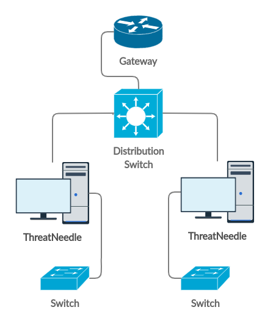
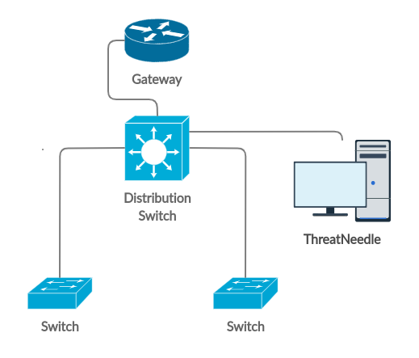
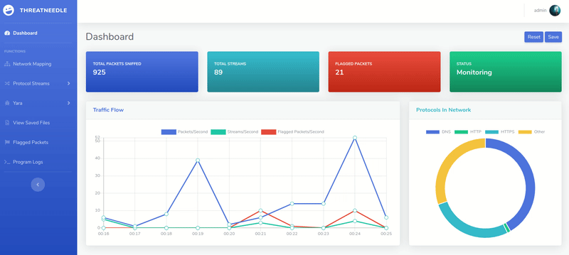
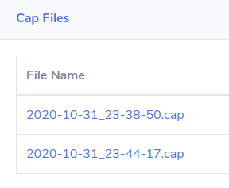
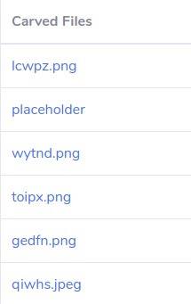
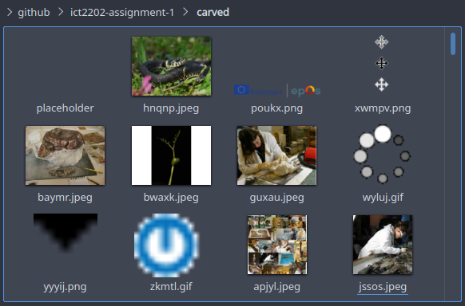
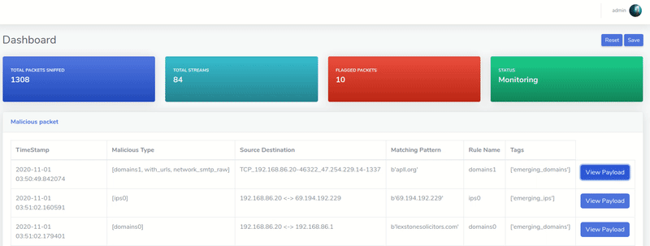
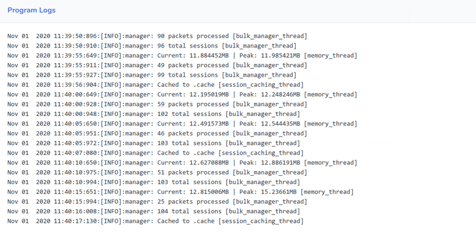

<p align="center">
🛠️
    <a href="https://github.com/xenthy/ict2202-assignment-1#%EF%B8%8F-installation-guide">Installation Guide</a> |
    <a href="https://github.com/xenthy/ict2202-assignment-1#-usage">Usage Guide</a>
🤸
    <br>
    
</p>
<p align="center">
<u><b> Making network forensics easy </b></u><br> Run the program, set rules, <b>sit back</b>, and monitor.
</p>

<p align="center">


</p>
<hr>

| <p align="center">👩‍💻 Linux (Debian) </p>                                                                                   | <p align="center">🪟 Windows </p>                                                                                          | <p align="center"> 🐋 Docker (Recommended)</p>                                                                            | <p align="center"> 🥔 Potato </p>                                                                                         |
| ------------------------------------------------------------------------------------------------------------------------- | ------------------------------------------------------------------------------------------------------------------------- | ------------------------------------------------------------------------------------------------------------------------ | ------------------------------------------------------------------------------------------------------------------------ |
| <p align="center"></p> | <p align="center"></p> | <p align="center"></p> | <p align="center"></p> |
| [Install Guide](https://github.com/xenthy/ict2202-assignment-1#️-linux-debian)                                             | [Install guide](https://github.com/xenthy/ict2202-assignment-1#-windows)                                                  | [Usage guide](https://github.com/xenthy/ict2202-assignment-1#-usage)                                                     | [Usage guide](https://www.youtube.com/watch?v=Qijju-y_NzI)                                                               |

<hr>

# ✨ Features
- **Real-time** updates
- View traffic on an **interactive network map**
- Identify malicious hosts on the network map (marked in red)
- On-demand saving packets to .cap file
- Automated **file carving**
- **Scan network traffic** against a database of YARA rules
- Add **custom** YARA rules
- **Super easy installation** ✨

# 🛠️ Installation Guide
## 🖥️ Linux (Debian)
**Cloning GitHub Repository:**
```console
➜ sudo apt install git
➜ git clone https://github.com/xenthy/ict2202-assignment-1
```

**Auto Configuring:**
```console
➜ cd \Path\to\ict2202-assignment-1
➜ ./configure
```

## 🪟 Windows
**Cloning GitHub Repository:**
```console
➜ git clone https://github.com/xenthy/ict2202-assignment-1
```

**Installing Python 3.8.5:**
1. [Install](https://www.python.org/ftp/python/3.8.5/python-3.8.5-amd64.exe) python
2. Set up environment PATH, if not you will not be unable to run `py`/`python` 
    1. Right-click on 'This PC' > Properties > Advance System Settings > Environment Variables
    2. Under System Variable, Select PATH
    3. Click on Edit, enter location. Usually: `C:\Python38\`

**Installing Dependencies:**
```console
➜ cd \Path\to\ict2202-assignment-1
➜ pip install -r requirements.txt
```

**Setting up GNU Make:**
1. [Install](https://sourceforge.net/projects/gnuwin32/files/make/3.81/make-3.81.exe/download?use_mirror=nchc&download=) Make for Windows
2. Set up environment PATH, if not you will not be unable to run `make`
   1. Right-click on 'This PC' > Properties > Advance System Settings > Environment Variables
   2. Under System Variable, Select PATH
   3. Click on Edit, enter Make location. Usually: `C:\Program Files (x86)\GnuWin32\bin`


# 🤸 Usage
## 🖥️ Linux (Debian)
**Running ThreatNeedle:**
```console
➜ make
or
➜ sudo python3 src/main.py
```

**Cleaning up (removes .pyc, .cap, and .cache/):**
```console
➜ make clean
```

## 🪟 Windows
**Running ThreatNeedle:**
```console
➜ make
or
➜ python src/main.py
```

**Cleaning up (removes .pyc, .cap, and .cache/):**
```console
➜ make clean
```

## 🐋 Docker
**Running ThreatNeedle:**

Due to the nature of this network forensic tool, the docker container has to run with the `--network host` flag in order to listen for network packets on the host's network interfaces.
Hence, this tool will **not work as intended on Windows** as `--network host` is not supported on docker for Windows.

```console
➜ make docker
or
➜ sudo docker build -t <name>:latest .
➜ sudo docker run --network host -ti <name> (run in interactive mode, able to view stdout, stderr)
➜ sudo docker run --network host -td <name> (run in detached mode)
```

**Cleaning up (removes ALL images, containers, volumes, and networks):**
```console
➜ make dockerclean
```

# 📜 User Guide
> Also available in the [wiki](https://github.com/xenthy/ict2202-assignment-1/wiki) page

## Table of Contents
  - [Setup](#setup)
  - [Startup](#startup)
  - [Configuration](#configuration)
  - [Overview](#overview)
  - [Global Functions](#global-functions)
  - [Dashboard](#dashboard)
  - [Network Mapping](#network-mapping)
  - [Protocol Streams](#protocol-streams)
  - [Yara](#yara)
  - [View Saved Files](#view-saved-files)
  - [Flagged Packets](#flagged-packets)
  - [Program Logs](#program-logs)
  - [Simulating an Attack](#simulating-an-attack)

## Setup
It is important to properly configure your environment to obtain the best results when monitoring your network. Improper configurations would lead to false negatives. I will provide 2 examples on how you may configure your environment.

**Example 1:**



You may choose to place ThreatNeedle in between switches to monitor the traffic of a single access switch. This configuration requires you to have at least 2 network interfaces. Don't worry, by default, ThreatNeedle sniffs packets from all interfaces on your device.

**Example 2:**



You may also choose to opt for an easier setup by connecting directly to a switch and enabling monitoring mode on that interface (port on the switch). The following would be an example on how to achieve that on most Cisco devices.

```console
➜ Switch(config)# monitor session 1 source interfaces <interface> both
➜ Switch(config)# monitor session 1 source vlan <vlan>
```

Read more on monitoring sessions on Cisco devices [here](https://www.cisco.com/c/en/us/td/docs/routers/nfvis/switch_command/b-nfvis-switch-command-reference/monitor_commands.html).

~~If you are feeling adventurous, you may also choose to perform a ARP poisoning attack on your own network to redirect all the traffic towards you. Do remember to enable IPv4/IPv6 forwarding. This method would however introduce unwanted traffic and might deteriorate the performance of ThreatNeedle.~~

**Monitoring on Wi-Fi:**
Monitoring your wireless traffic is also possible. Just connect ThreatNeedle to a wireless access point and you're good to go. But do note that ThreatNeedle will automatically use monitor mode **only on Linux based systems** due to the limitations of sniffing using monitor mode on Windows based systems.

## Startup
The tool will start monitoring your network traffic upon program execution. Visit `http://127.0.0.1:8000` to view the dashboard. In the event of you not being able to view the dashboard, try to restart your browser, computer and/or check if port 8000 is in use. You may press `q` and `enter` in your terminal to safely terminate the session.

It is recommended that you run the tool using docker in detached mode. [See how](https://github.com/xenthy/ict2202-assignment-1#-docker).

## Configuration
You can change default file paths and thread creation intervals in `src/config.py`. You will have to manually create the folders yourself. Failure to do so will lead to a runtime error.

**Default Configuration:**
```py
# Path to logger folder
LOGGER_PATH = "./logs/"

# Datetime format
DATETIME_FORMAT = "%Y-%m-%d_%H-%M-%S"

# Path to cap folder
CAP_PATH = "./cap/"
CAP_EXTENSION = ".cap"

# Path to rules folder
RULES_DIR = "./rules/"

# Path to threat-intel folder
INTEL_DIR = "./rules/threat_intel/"

# Path to threat-intel folder
CUSTOM_RULES_DIR = "./rules/custom_rules/"

# Path to malware rules folder
MAL_DIR = "./rules/malware/"

# Path to carved files directory
CARVED_DIR = "./carved/"

# Path to session cache folder
SESSION_CACHE_PATH = "./.cache"

# THREAD INTERVALS
MEMORY_WATCHDOG_INTERVAL = 5
BULK_MANAGER_INTERVAL = 5  # handling "session yara" and "threat"
SESSION_CACHING_INTERVAL = 10
```

## Overview


The main dashboard for ThreadNeedle displays an overview of all the data collected in the network. All of these elements update in real-time so you would be able to monitor your network without pressing a single button.

## Global Functions
**Reset Button**: To reset all collected data without having to restart the tool.
- Carved files and .cap files in the cap/ folder would not be deleted
- You would still be able to view previously captured sessions
- "saving" would not be interrupted

**Save/Stop Saving**
You may choose to save the captured packets in a `.cap` file by clicking on the `save` button. Once clicked, a `stop saving` button would be available to stop the capturing of packets.

The `.cap` files are saved in the `cap/` folder in the following format: `yyyy-mm-dd_HH-MM-SS.cap`. The timestamp of the file would be the date and time of when you started the saving.

You may also wish to start/stop saving on your terminal ([interactive mode](https://github.com/xenthy/ict2202-assignment-1#-docker) for docker)
```console
Sniffer is running but not saving anything locally
Dashboard: http://127.0.0.1:8000 | 'q' to end the program
Type "start" to start saving:
➜ start

Sniffer is running saving packets locally
Dashboard: http://127.0.0.1:8000 | 'q' to end the program
Type "stop" to stop saving:
➜ stop

# Note: entering `q` to end the program would automatically stop and
# save the captured packets if saving was enabled
```

## Dashboard
> path: /

- **Total Packets Sniffed** displays the total number of packets sniffed in real-time
- **Total Streams** displays the total number of streams/sessions captured in real-time
- **Flagged Packets** displays the total number of flagged packets detected in real-time
- **Status** shows `monitoring` when program is started. Shows `capturing` when saving is enabled
- **Traffic Flow** is a real-time visualization of the total packets, streams and flagged packets
- **Protocols in Network** shows the different protocols identified in the form of a pie-chart

## Network Mapping
> path: /network


The network map displays all the hosts detected through sniffing as a circle (node). Hosts are then joined to other hosts if they had communicated. The thickness of each line (edge) represents the number of packets sent from either of the hosts.

**Features of the map:**
- The map updates itself every 30 seconds.
- All the nodes are also interactive so you may choose to move them around to your liking.
- The number of packets sent can be viewed by clicking on an edge as shown below.

Hosts in **red** are hosts flagged by our detection system using YARA rules. More on [YARA](https://github.com/xenthy/ict2202-assignment-1#yara).

An attack conducted by a malicious host would look similar to the following. Where hosts `192.168.86.20`, `192.168.86.25` and `192.168.86.28` are residing on the same network (your network).


## Protocol Streams
> **TCP Streams** path: /viewtcp |
> **UDP Streams** path: /viewudp |
> **ARP Streams** path: /viewarp

Streams or Sessions for TCP, UDP and ARP can be viewed on this page. 


You are also able to download and view the binary files of each stream which consists of all of the payloads from each packet in the stream/session. In a case where a host is not using a secure protocol (SSH, HTTPS, SFTP), you might be able to manually carve out files.


However, our tool is able to automatically detect and carve out files. These files can be viewed [here](https://github.com/xenthy/ict2202-assignment-1#view-saved-files).

## Yara
**View Rules**
> path: /rules


This page allows you to see all of the YARA rules that are loaded in the program.


You are also able to view the individual rules to reference.

**Add Rule**
> path: /addrule


This form allows you to add your own custom rules into the program, which will instantly be saved locally in the `rules/` directory. Upon adding a new rule, it will be loaded and compiled instantly to be used in the running program's YARA scans.

> Note: this form does not check for naming errors, therefore you need to ensure that the variable names are proper and correct

You may also wish to find or craft your own set of rules and add them into the `rules/` folder. The following are links to crafting your own rule and online databases for existing YARA rules.
- Crafting YARA rules. [Link](https://yara.readthedocs.io/en/stable/writingrules.html)
- YARA Rules Database example. [Link](https://github.com/Yara-Rules/rules)


## View Saved Files
> path: /viewfile



`.cap` files are files that are saved (by you) and can be located in the `cap/` folder. These files can then be viewed in network packet viewing tools such as [Wireshark](https://www.wireshark.org).



Carving of files is automated and runs in the background upon program execution. The tool analyses the payload of selected packets and scans for traces of files.

Both the `.cap` files and carved files can be downloaded from the dashboard or viewed in the `cap/` and `carved/` folder respectively.



## Flagged Packets
> path: /flagged



This page will show any packets that have been flagged by YARA scans.
Each flagged packet will show 
- timestamp of the packet
- the malicious category that the YARA rule(s) classified
- Source and Destination IP address and ports of that packet
- the pattern that was matched and flagged (in bytes)
- YARA rule's name that triggered the flag
- the YARA rule's tag (sub-classification of YARA rule)

You are able to view the payload of an individual packet that triggered the YARA scan.

> Note: There may be an occurrence of multiple flags of a single packet


## Program Logs
> path: /logs



Here, you are able to observe the program flow. Memory usage for memory allocations can also be viewed here. If the dashboard seems to load slower than usual or if the [network map](https://github.com/xenthy/ict2202-assignment-1#network-mapping) is too cluttered, [reset](https://github.com/xenthy/ict2202-assignment-1#global-functions) the session and you are good to go.

Uncaught/Unhandled errors would normally appear here or in the standard error.

You are also able to change the verbose level of the logs in `src/logger.py`.

**Verbose Levels (highest to lowest):**
- `logging.DEBUG`
- `logging.INFO` (default)
- `logging.WARNING`
- `logging.ERROR`
- `logging.CRITICAL`

> The complete log file is available at `logs/program.log`

If you come across a peculiar issue, do open an [issue](https://github.com/xenthy/ict2202-assignment-1/issues).

## Simulating an Attack
If you want to test TreatNeedle's accuracy in your network, you are in luck! We have created a simple script that utilizes multithreading to send network packets to trigger ThreatNeedle's detection system. Copy `simulate.py` and the whole `rules/` folder to another host and you may begin testing.

**Usage of `simulate.py`:**
```console
➜ ./simulate.py -h                                                                                         130 ⨯
usage: simulate.py [-h] [--ip IP_COUNT] [--url URL_COUNT] [--email EMAIL_COUNT] [--media MEDIA_COUNT]

Simulate threats

optional arguments:
   -h, --help           show this help message and exit
  --ip IP_COUNT, -i IP_COUNT
                        number of IPs to probe (>= 0)
  --url URL_COUNT, -u URL_COUNT
                        number of URLs to probe (>= 0)
  --email EMAIL_COUNT, -e EMAIL_COUNT
                        number of malicious Emails to simulate (>= 0)
  --media MEDIA_COUNT, -m MEDIA_COUNT
                        number of malicious Media files to simulate (>= 0)
```

**Example Use Cases:**
```console
➜ ./simulate.py
# probes 1 IP, 1 domain, and sends an email phishing payload

➜ ./simulate.py --ip 10 --url 100
# probes 10 IPs, 100 domain
```

Don't worry, this script uses `ping` and `nslookup`and does not connect to any of the malicious hosts. 

# ✨ Collaborators
| Name                | GitHub                                     |
| ------------------- | ------------------------------------------ |
| **Zen Tan**         | [@xenthy](https://github.com/xenthy)       |
| **Wong Chong Peng** | [@chong00](https://github.com/chong00)     |
| **Tan Yee Tat**     | [@ethancunt](https://github.com/ethancunt) |
