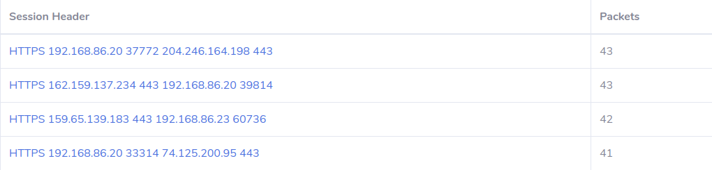

<p align="center">
🛠️
    <a href="https://github.com/xenthy/ict2202-assignment-1#%EF%B8%8F-installation-guide">Installation Guide</a> |
    <a href="https://github.com/xenthy/ict2202-assignment-1#-usage">Usage Guide</a>
🤸
    <br>
    
</p>
<p align="center">
<u><b> Making network forensics easy </b></u><br> Run the program, set rules, <b>sit back</b>, and monitor.
</p>

<p align="center">


</p>
<hr>

| <p align="center">👩‍💻 Linux (Debian) Recommended </p>                                                                       | <p align="center">🪟 Windows </p>                                                                                          | <p align="center"> 🐋 Docker </p>                                                                                         | <p align="center"> 🥔 Potato </p>                                                                                         |
| ------------------------------------------------------------------------------------------------------------------------- | ------------------------------------------------------------------------------------------------------------------------- | ------------------------------------------------------------------------------------------------------------------------ | ------------------------------------------------------------------------------------------------------------------------ |
| <p align="center"></p> | <p align="center"></p> | <p align="center"></p> | <p align="center"></p> |
| [Install Guide](https://github.com/xenthy/ict2202-assignment-1#️-linux-debian)                                             | [Install guide](https://github.com/xenthy/ict2202-assignment-1#-windows)                                                  | [Usage guide](https://github.com/xenthy/ict2202-assignment-1#-usage)                                                     | [Usage guide](https://www.youtube.com/watch?v=Qijju-y_NzI)                                                               |

<hr>

- [🛠️ Installation Guide](#️-installation-guide)
  - [🖥️ Linux (Debian)](#️-linux-debian)
  - [🪟 Windows](#-windows)
- [🏃‍♂️ Running the Application](#️-running-the-application)
- [🤸 Usage](#-usage)
  - [🖥️ Linux (Debian)](#️-linux-debian-1)
  - [🪟 Windows](#-windows-1)
  - [🐋 Docker](#-docker)
- [📜 User Guide](#-user-guide)
  - [Startup](#startup)
  - [Overview](#overview)
  - [Global Functions](#global-functions)
  - [Dashboard](#dashboard)
  - [Network Mapping](#network-mapping)
  - [Protocol Streams](#protocol-streams)
  - [Yara](#yara)
  - [View Saved Files](#view-saved-files)
  - [Flagged Packets](#flagged-packets)
  - [Program Logs](#program-logs)
- [✨ Collaborators](#-collaborators)

# 🛠️ Installation Guide
## 🖥️ Linux (Debian)
**Cloning GitHub Repository:**
```console
➜ sudo apt install git
➜ git clone https://github.com/xenthy/ict2202-assignment-1
```

**Auto Configuring:**
```console
➜ cd \Path\to\ict2202-assignment-1
➜ ./configure
```

## 🪟 Windows
**Cloning GitHub Repository:**
```console
➜ git clone https://github.com/xenthy/ict2202-assignment-1
```

**Installing Python 3.8.5:**
1. [Install](https://www.python.org/ftp/python/3.8.5/python-3.8.5-amd64.exe) python
2. Set up environment PATH, if not you will not be unable to run `py`/`python` 
    1. Right-click on 'This PC' > Properties > Advance System Settings > Environment Variables
    2. Under System Variable, Select PATH
    3. Click on Edit, enter location. Usually: `C:\Python38\`

**Installing Dependencies:**
```console
➜ cd \Path\to\ict2202-assignment-1
➜ pip install -r requirements.txt
```

**Setting up GNU Make:**
1. [Install](https://sourceforge.net/projects/gnuwin32/files/make/3.81/make-3.81.exe/download?use_mirror=nchc&download=) Make for Windows
2. Set up environment PATH, if not you will not be unable to run `make`
   1. Right-click on 'This PC' > Properties > Advance System Settings > Environment Variables
   2. Under System Variable, Select PATH
   3. Click on Edit, enter Make location. Usually: `C:\Program Files (x86)\GnuWin32\bin`


# 🏃‍♂️ Running the Application
1. To run the program
```console
➜ cd \Path\to\ict2202-assignment-1
➜ make (password required)
```
2. To clean temporary files (.pyc, .cap, ./.cache)
```console
➜ make clean
```

# 🤸 Usage
## 🖥️ Linux (Debian)
**Running ThreatNeedle:**
```console
➜ make
or
➜ sudo python3 src/main.py
```

**Cleaning up (removes .pyc, .cap, and .cache/):**
```console
➜ make clean
```

## 🪟 Windows
**Running ThreatNeedle:**
```console
➜ make
or
➜ python src/main.py
```

**Cleaning up (removes .pyc, .cap, and .cache/):**
```console
➜ make clean
```

## 🐋 Docker
**Running ThreatNeedle:**

Due to the nature of this network forensic tool, the docker container has to run with the `--network host` flag in order to listen for network packets on the host's network interfaces.
Hence, this tool will **not work as intended on Windows** as `--network host` is not supported on docker for Windows.

```console
➜ make doc
or
➜ sudo docker build -t <name>:latest .
➜ sudo docker run --network host -ti <name> (run in interactive mode, able to view stdout, stderr)
➜ sudo docker run --network host -td <name> (run in detached mode)
```

**Cleaning up (removes ALL images, containers, volumes, and networks):**
```console
➜ make docclean
```

# 📜 User Guide
> Also available in the [wiki](https://github.com/xenthy/ict2202-assignment-1/wiki) page

## Startup
The tool will start monitoring your network traffic upon program execution. Visit `http://127.0.0.1:8000` to view the dashboard. In the event of you not being able to view the dashboard, try to restart your browser, computer and/or check if port 8000 is in use. You may press `q` and `enter` in your terminal to safely terminate the session.

It is recommended that you run the tool using docker in detached mode. [See how](https://github.com/xenthy/ict2202-assignment-1#-docker).

## Overview


The main dashboard for ThreadNeedle displays an overview of all the data collected in the network. All of these elements update in real-time so you would be able to monitor your network without pressing a single button.

## Global Functions
**Reset Button**: To reset all collected data without having to restart the tool.
- Carved files and .cap files in the cap/ folder would not be deleted
- You would still be able to view previously captured sessions
- "saving" would not be interrupted

**Save/Stop Saving**
You may choose to save the captured packets in a `.cap` file by clicking on the `save` button. Once clicked, a `stop saving` button would be available to stop the capturing of packets.

The `.cap` files are saved in the `cap/` folder in the following format: `yyyy-mm-dd_HH-MM-SS.cap`. The timestamp of the file would be the date and time of when you started the saving.

You may also wish to start/stop saving on your terminal ([interactive mode](https://github.com/xenthy/ict2202-assignment-1#-docker) for docker)
```console
Sniffer is running but not saving anything locally
Dashboard: http://127.0.0.1:8000 | 'q' to end the program
Type "start" to start saving:
➜ start

Sniffer is running saving packets locally
Dashboard: http://127.0.0.1:8000 | 'q' to end the program
Type "stop" to stop saving:
➜ stop

# Note: entering `q` to end the program would automatically stop and save the captured packets if saving was enabled
```

## Dashboard
> path: /

- **Total Packets Sniffed** displays the total number of packets sniffed in real-time
- **Total Streams** displays the total number of streams/sessions captured in real-time
- **Flagged Packets** displays the total number of flagged packets detected in real-time
- **Status** shows `monitoring` when program is started. Shows `capturing` when saving is enabled
- **Traffic Flow** is a real-time visualization of the total packets, streams and flagged packets
- **Protocols in Network** shows the different protocols identified in the form of a pie-chart

## Network Mapping
> path: /network


The network map displays all the hosts detected through sniffing as a circle (node). Hosts are then joined to other hosts if they had communicated. The thickness of each line (edge) represents the number of packets sent from either of the hosts.

**Features of the map:**
- The map updates itself every 30 seconds.
- All the nodes are also interactive so you may choose to move them around to your liking.
- The number of packets sent can be viewed by clicking on an edge as shown below.


Hosts in **red** are hosts flagged by our detection system using YARA rules. More on [YARA](https://github.com/xenthy/ict2202-assignment-1#yara).

An attack conducted by a malicious host would look similar to the following. Where hosts `192.168.86.20`, `192.168.86.25` and `192.168.86.28` are residing on the same network (your network).


## Protocol Streams
> **TCP Streams** path: /viewtcp |
> **UDP Streams** path: /viewudp |
> **ARP Streams** path: /viewarp




## Yara
**View Rules**
> path: /rules


**Add Rule**
> path: /addrule


## View Saved Files
> path: /viewfile

## Flagged Packets
> path: /flagged

## Program Logs
> path: /logs

# ✨ Collaborators
| Name                | GitHub                                     |
| ------------------- | ------------------------------------------ |
| **Zen Tan**         | [@xenthy](https://github.com/xenthy)       |
| **Wong Chong Peng** | [@chong00](https://github.com/chong00)     |
| **Tan Yee Tat**     | [@ethancunt](https://github.com/ethancunt) |
